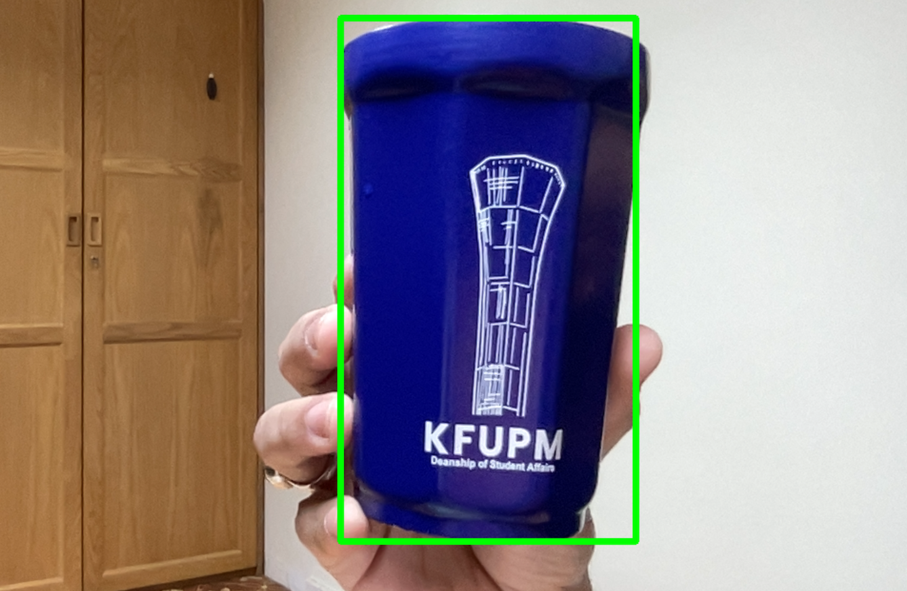

# 🎯 Real-Time Color Detection using OpenCV (Python)

This project performs **real-time object color detection** using a
webcam feed.\
A bounding box is drawn around any object matching a target **BGR color
value**.

It uses:

-   **OpenCV** → for image processing\
-   **Pillow (PIL)** → for bounding box extraction\
-   **NumPy** → for handling arrays\
-   **HSV color space** → for more accurate color detection

------------------------------------------------------------------------

## 📦 Features

✔ Detects a target color in real time\
✔ Automatically converts BGR → HSV and generates color limits\
✔ Handles tricky colors like **red** (wraps around HSV hue values)\
✔ Draws a dynamic bounding box around the detected object\
✔ Very lightweight and beginner-friendly

------------------------------------------------------------------------

## 📁 Project Structure

    .
    ├── main.py
    ├── util.py
    ├── requirements.txt
    ├── result.png
    └── README.md

------------------------------------------------------------------------

## 🔧 Installation

Clone the repository:

``` bash
git clone https://github.com/atharparvezce/color-detection-opencv.git
cd color-detection-opencv/
```

Install dependencies:

``` bash
pip install -r requirements.txt
```

------------------------------------------------------------------------

## ▶️ Usage

Run the program:

``` bash
python main.py
```

Press **Q** to exit the camera window.

------------------------------------------------------------------------

## 🎨 Changing the Target Color

To detect a different color, update the BGR value inside `main.py`:

``` python
yellow = [255, 0, 0]   # Example: blue in BGR
```

Common BGR colors:

  Color    BGR
  -------- -------------------
  Blue     `[255, 0, 0]`
  Green    `[0, 255, 0]`
  Red      `[0, 0, 255]`
  Yellow   `[0, 255, 255]`
  Black    `[0, 0, 0]`
  White    `[255, 255, 255]`

Red is handled properly in `util.py` using HSV wrap-around logic.

------------------------------------------------------------------------

## 🧠 How It Works

### 1️⃣ Convert BGR → HSV

HSV is better for color detection because the hue value uniquely
identifies colors.

### 2️⃣ Compute lower & upper limits

`util.py` automatically generates HSV ranges based on your chosen BGR
color.

### 3️⃣ Generate a mask

`cv2.inRange()` isolates pixels that match the target color.

### 4️⃣ Convert mask → bounding box

`Pillow`'s `getbbox()` extracts the bounding box of the mask.

### 5️⃣ Draw rectangle on the frame

OpenCV draws a green box around the detected area.

------------------------------------------------------------------------

## 📸 Result




------------------------------------------------------------------------

## 📜 Requirements

    opencv-python==4.6.0.66
    numpy==1.23.4
    Pillow==9.2.0

Install using:

``` bash
pip install -r requirements.txt
```

------------------------------------------------------------------------

## 🙌 Contributing

Feel free to fork this project and open pull requests if you want to
improve detection accuracy or add new features!

------------------------------------------------------------------------

## 📄 License

This project is open-source and free to use.
